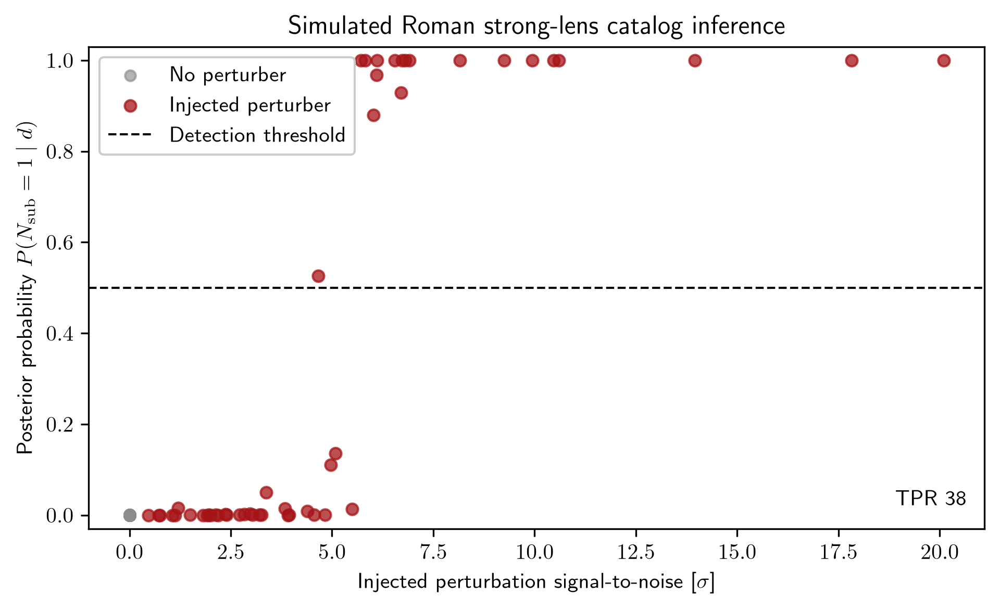

# PCAT

## Scientific purpose

PCAT is a transdimensional, hierarchical Bayesian framework for inferring a catalog-level posterior from Poisson-distributed data. It is designed for problems where the number of sources and their parameters are not fixed a priori, and where the model space itself is a mixture of competing catalog configurations.

The primary scientific use cases are:

- probabilistic source catalogs from image or photon-count data;
- transdimensional inference over source populations;
- membership or detection uncertainty in crowded fields;
- forward modeling and posterior diagnostics for catalog-level summaries.

The core method is introduced in Daylan, Portillo & Finkbeiner (2016) and extended for different image and catalog analysis workflows.

## Repository role in the ecosystem

This repository is the core probabilistic cataloging engine in the broader astrophysics software stack. It is intended to work with the shared numerical and plotting infrastructure in [tdpy](../tdpy), and it is conceptually adjacent to time-domain and imaging workflows in repositories such as [miletos](../miletos), [lygos](../lygos), and [assos](../assos).

## Installation

A modern installation path is:

```bash
cd /path/to/pcat
pip install -e .
export PCAT_PATH=/path/to/pcat
```

`PCAT_PATH` identifies the Git repository root. Its `data/` and `visuals/` directories are ignored by Git. The separate `PCAT_DATA_PATH` variable remains the working-data and pipeline-output root used by scientific runs.

This repository expects the shared library `tdpy` to be installed in the same Python environment. For local development, this is usually easiest with:

```bash
cd /path/to/tdpy
pip install -e .
cd /path/to/pcat
pip install -e .
```

## Roman strong-lens example

The executable example uses the compact PCAT Roman benchmark to simulate 100 strong-lens images. Half contain one dark-matter perturber drawn at a candidate position around the macro Einstein ring, and half contain no perturber. The catalog approximation compares zero- and one-perturber models after Roman point-spread-function convolution and Poisson plus read noise.

```bash
python examples/roman_lens_catalog_diagnostic.py --typefileplot png
```



For the fixed seed, the approximate catalog classifier recovers 38% of injected perturbers above a posterior threshold of 0.5, produces no false positives among the 50 null lenses, and localizes 84% of injected perturbers to the correct candidate position. The mean one-perturber posterior probability is 0.37 for injected systems and $4.6\times10^{-5}$ for null systems. These values characterize this clearly labeled simulation and are not forecasts from real Roman observations.

PCAT remains a research framework rather than a turnkey black-box package. Full transdimensional runs initialize a model configuration, define a likelihood and data product, and call `pcat.main.init(...)` with a populated configuration dictionary.

## Output and visualization conventions

PCAT is designed to write diagnostics into a project-specific output tree rooted at `PCAT_DATA_PATH` or a compatible fallback such as `TDGU_DATA_PATH`. The active code expects a directory structure with `data/` and `visuals/` subdirectories, and the plotting routines are designed to expose the main input, intermediate, and posterior-summary diagnostics rather than only final tables.

## Important files

- `pcat/main.py`: main scientific engine and workflow logic
- `pcat/__init__.py`: package re-export shim for legacy compatibility
- `pcat/test.py`: historical validation and configuration tests
- `tests/`: modern import and path smoke checks

## Current development status

This repository is in a transition state:

- stable: package importability and modern packaging compatibility
- research-grade: core transdimensional sampling routines and model logic
- legacy: some scripts and configuration patterns remain Python-2-era or repo-local in style

The active strategy is to preserve scientifically useful functionality while making the package more portable, inspectable, and maintainable.

## References

- Daylan, Portillo, & Finkbeiner (2016), transdimensional Bayesian catalog inference
- The project documentation previously described in the repository docs and older ReadTheDocs material

## Related repositories

- [tdpy](../tdpy): shared numerical utilities, plotting, and path handling
- [miletos](../miletos): higher-level time-domain workflow orchestration
- [lygos](../lygos): image-domain photometry and pipeline extraction
- [assos](../assos): forward-modeling and imaging utilities

