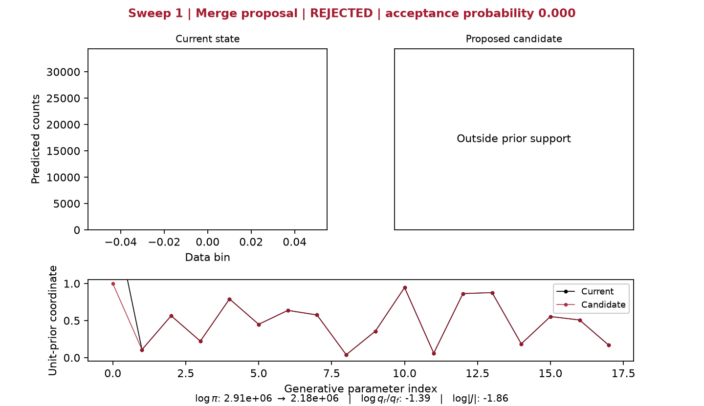
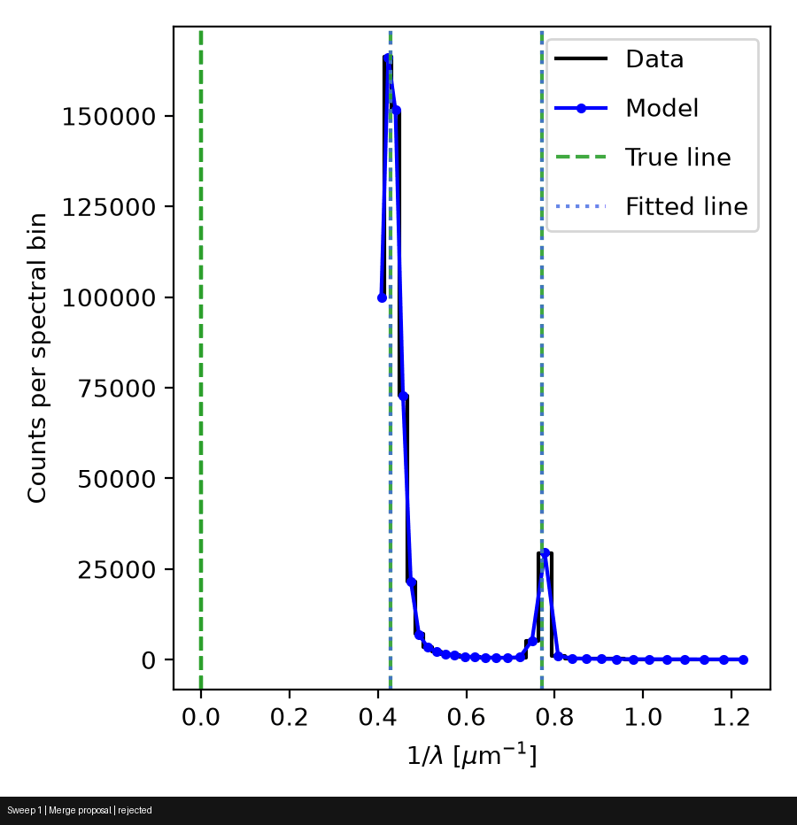
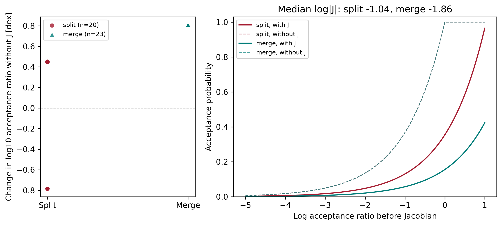
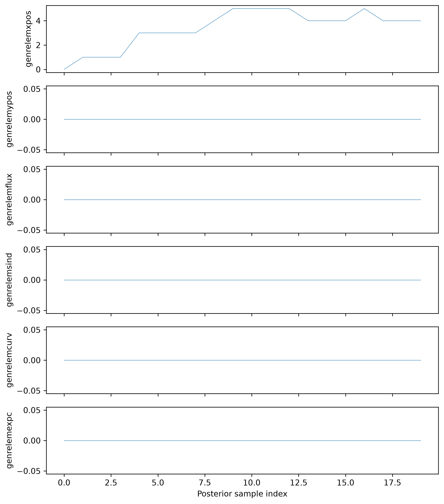
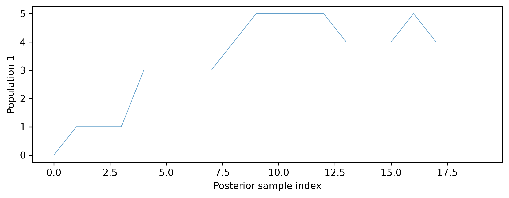
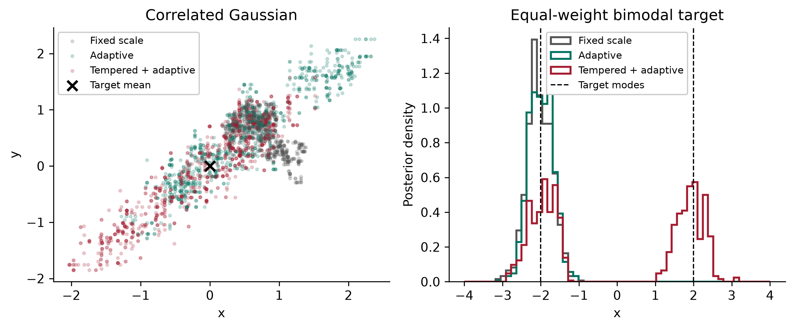
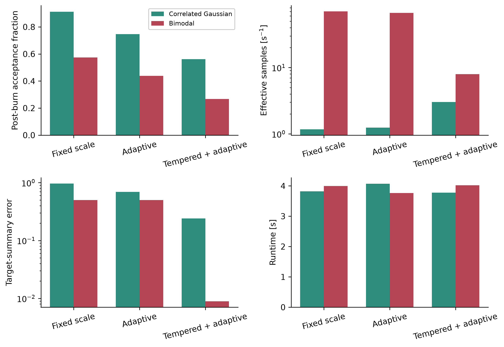
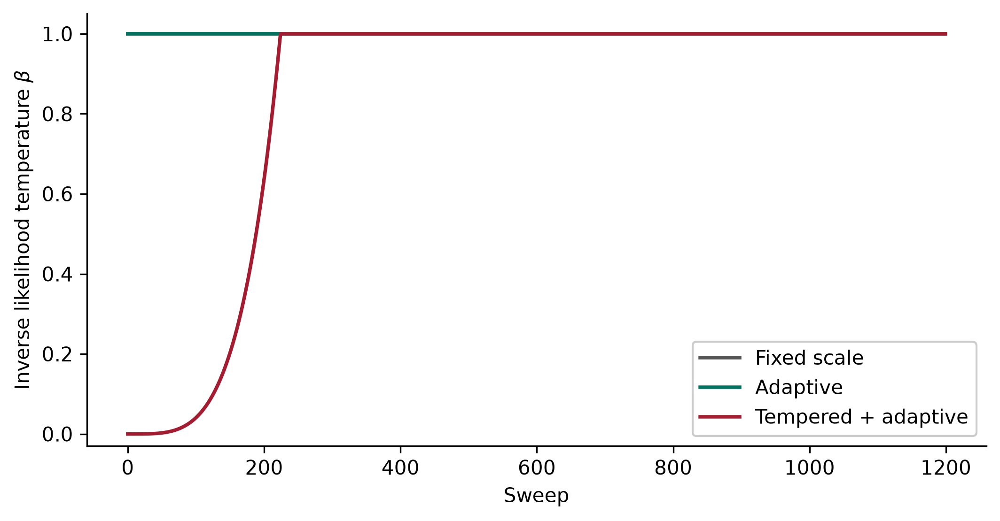
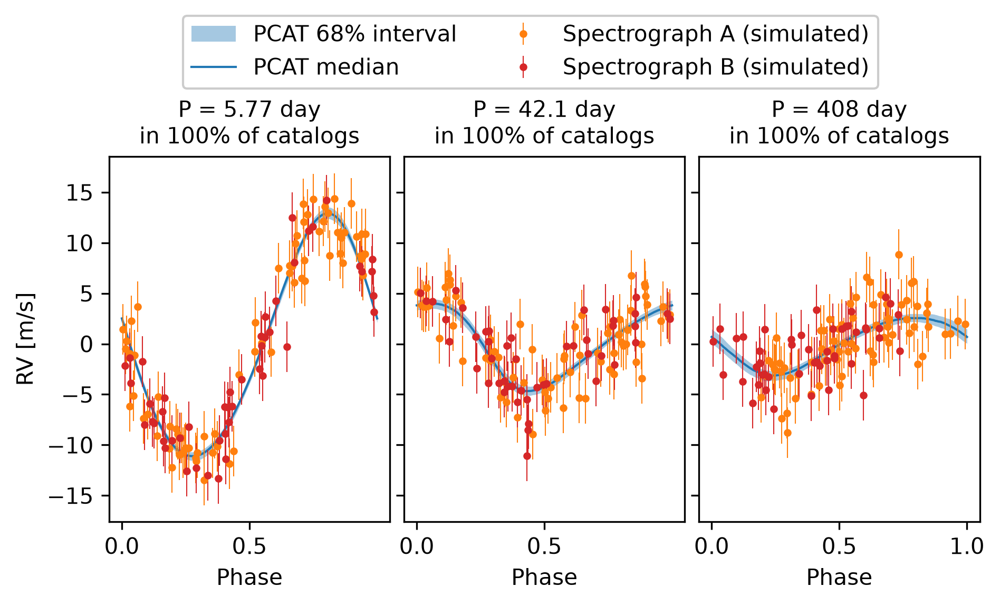
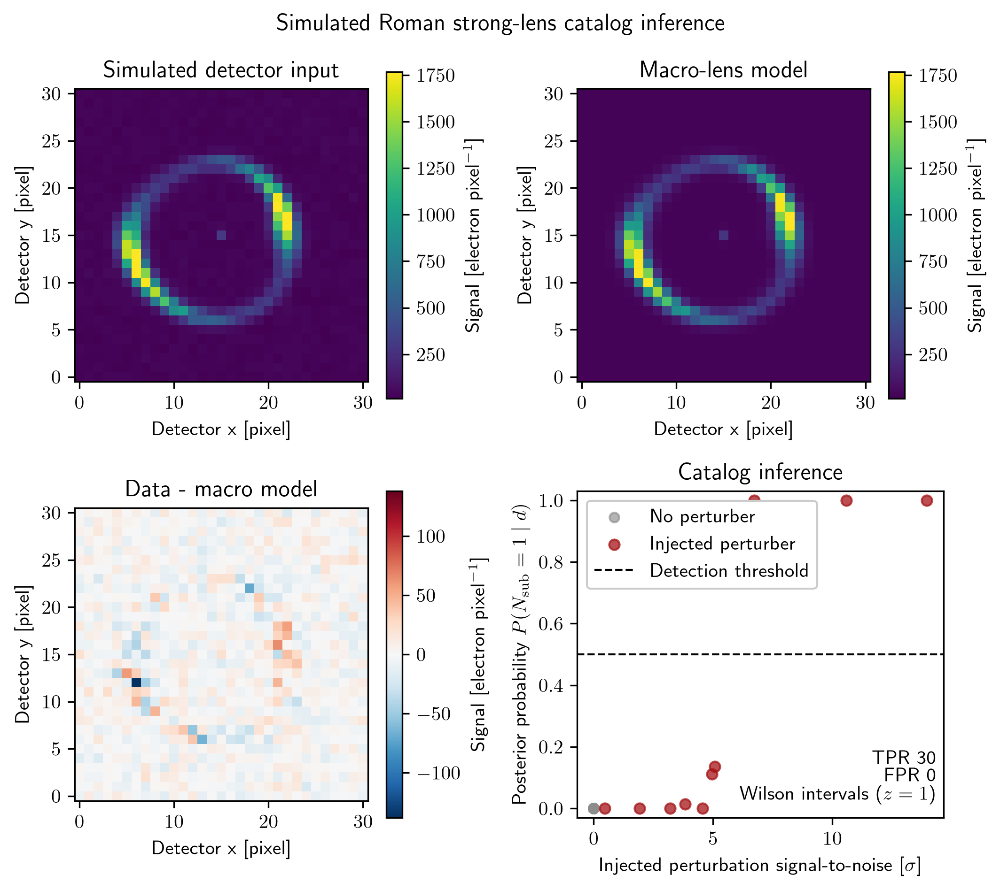

# PCAT


## Purpose

PCAT is a Bayesian inference framework for Poisson-distributed images, photon
events, spectra, and other data. It supports fixed-dimensional inference and
transdimensional inference over a metamodel. A model has a specified parameter
dimension; a metamodel combines candidate models that may have different
dimensions. During transdimensional inference PCAT samples both the selected
model and its parameters. Catalogs are one application, and their populations
can be inferred jointly with fixed-dimensional parameters such as background
normalizations and population hyperparameters.

Primary use cases include

- probabilistic source catalogs from images and photon-count data
- fixed-dimensional inference for physical parameters
- transdimensional inference over metamodels, including variable-size source,
  flare, and planet populations
- crowded-field detection and membership uncertainty
- strong-lens and substructure forward modeling
- spectral-line decomposition with configurable intrinsic profiles and instrument line-spread functions
- transdimensional flare catalogs with Gaussian, exponential, FRED, and Davenport profiles
- construction of custom likelihoods for supported inference workflows

[Daylan, Portillo, and Finkbeiner (2017)](https://doi.org/10.3847/1538-4357/aa679e)
introduced the core method for gamma-ray point-source populations. The maintained examples extend the framework to
Gaussian mixtures, strong gravitational lenses, spectral lines, catalog
association, and detector point-spread functions.

## Posterior samples


Each synchronized frame combines nine changing views from an unbinned Gaussian
mixture of simulated events, a simulated Fermi-LAT northern Galactic cap source
catalog inspired by Daylan et al. (2017), a Daylan et al. (2018) lens-deflection
example, observed JWST/MIRI line-center catalogs, simulated Voigt lines,
PSF-convolved Roman/WFI strong-lens arcs, and simulated flare photometry, radial
velocities, and transit times. The time-series and line-histogram axes remain
fixed across frames. The publication-inspired simulations illustrate PCAT's
sampling behavior and do not reproduce published posterior values.

## Every proposed state

The posterior animation above visualizes retained chain states. Set
`boolmakeanimprop=True` to additionally render every proposed candidate before
the Metropolis-Hastings decision, whether accepted or rejected. The candidate
animation compares current and proposed predictions and unit-prior coordinates,
and labels the proposal type, acceptance probability, decision, proposal-density
ratio, and Jacobian. Rejected candidates are proposal diagnostics rather than
posterior samples.



The matching retained-state sequence from the same short simulated Voigt-line
run is shown below. It contains frames only at `numbswepplot` cadence, while the
candidate animation contains all 120 sweeps.



### Jacobian in split and merge moves

PCAT splits a parent amplitude-coordinate value $F$ into $rF$ and $(1-r)F$.
This amplitude-fraction transformation contributes $\log|J|=\log F$ to the split acceptance ratio; the
reverse merge uses the negative term. The example records the unclipped log
acceptance ratio, then compares each prior-valid proposal with a counterfactual
that omits only the Jacobian. Its acceptance curves show how the median
split/merge Jacobians change acceptance probability at a fixed remainder of the
ratio. The counterfactual is not a second chain.



## Package organization

PCAT is the sole posterior sampler in this software ecosystem. New sampling integrations should use `pcat.sampling` for the public entry
points. `pcat.main` remains the implementation and backward-compatible access
path while its tightly coupled engine is decomposed. Fixed-dimensional
inference, diagnostics, plotting, catalog association, paths, and PSF utilities
live in their respective modules under `pcat/`.

## Inference methods

### Fixed-dimensional inference

In fixed-dimensional inference the parameter count and selected model stay
constant throughout a chain. PCAT updates the model parameters and any
fixed-dimensional nuisance or population parameters with its native proposals,
priors, persistence, convergence tools, and final processing. Use
`pcat.fixed.sample_posterior` for a compact interface that returns samples keyed
by parameter name, or `pcat.fixed.sample_fixed` to configure the native pipeline
directly.

### Transdimensional metamodel inference

A metamodel is a collection of candidate models whose parameter dimensions may
differ. PCAT samples the model index and the parameters together, including
shared parameters that remain in every candidate. For example, a source-catalog
metamodel can vary the number of sources while also sampling background
normalizations and population hyperparameters. Catalog inference is one
transdimensional application of this more general approach.

### Building a custom likelihood

The likelihood is independent of the distinction between a model and a
metamodel. To use a custom likelihood for fixed-dimensional inference, define a
callback with signature ``retr_llik(gdat, strgmodl, values)`` that returns the
log likelihood only. Configure priors separately, then pass the callback to
`sample_fixed`:

```python
from pcat import sample_fixed

result = sample_fixed(
	retr_llik=log_likelihood,
	parameter_names=("mean", "scale"),
	prior_types=("self", "gaus"),
	prior_minima=(-5.0, 0.0),
	prior_maxima=(5.0, 5.0),
	prior_means=(0.0, 1.0),
	prior_stdvs=(1.0, 0.2),
	initial_values=(0.0, 1.0),
	proposal_scales=(0.05, 0.05),
	proposal_correlation=((1.0, 0.3), (0.3, 1.0)),
	pathbase="/path/to/project-root",
	strgcnfg="fixed-example",
)
```

``"self"`` parameters have uniform priors between their minima and maxima;
``"gaus"`` parameters use the specified means and standard deviations. PCAT
proposes in unit-prior coordinates and applies its inverse-CDF transforms.
Generic fixed-dimensional runs set birth/death and split/merge probabilities to
zero, so only the native type-0 within-model proposal is active. The returned
object is the persisted ``gdatfinlpost`` state.

### Proposal types and mixing moves

PCAT is the only sampler in this software ecosystem. The
``pcat.fixed.sample_posterior`` interface is useful for quick fixed-dimensional
fits with a likelihood ``retr_llik(para, gdat)``. It returns a dictionary of
posterior samples keyed by parameter name, optionally with derived variables,
trace plots, and a saved posterior summary. It runs several independent PCAT
chains and discards their burn-in.

By default, type-0 moves perturb one parameter at a time. Set
``probpropblock`` above zero to mix in correlated block moves using
``proposal_correlation``; ``factpropblock`` scales those block increments.
These moves retain PCAT's standard acceptance, adaptation, persistence, and
final-processing machinery. Set ``probdemc`` above zero to mix in
differential-evolution jumps (ter Braak 2006) drawn from a bounded history of
the chain's own visited states (``numbdemchist``, default 1,000 states); this
proposal is symmetric, so it needs no change to the acceptance ratio and can
help mixing when parameters are correlated in ways ``proposal_correlation``
does not capture.

For transdimensional runs (``numbpopl`` > 0), set ``probjump`` above zero to
mix in a dimension-preserving jump: one randomly chosen existing element is
redrawn entirely from its own prior, holding the number of elements fixed.
Because the redrawn element's prior exactly cancels its independence-proposal
density, its acceptance ratio is the plain likelihood ratio, with no Jacobian
or transition-probability term. This can help the sampler escape local optima
in element parameters (e.g. near-degenerate positions) that birth, death,
split, and merge moves reach only indirectly.

### Dynamic convergence-based stopping

By default PCAT samples for a fixed number of sweeps (``numbswep``). Set
``boolcheckconv=True`` to instead stop automatically once the chain(s) have
converged, using split-chain (or, with ``numbproc`` > 1, genuinely
cross-chain) Gelman-Rubin R-hat combined with an effective-sample-size (ESS)
floor computed from the autocorrelation time. Relevant settings:

- ``numbsampconvmin``: minimum number of retained samples before the first
  check is attempted.
- ``numbsampconvcheck``: how often (in retained samples) to re-check
  convergence after the minimum is reached.
- ``maxmconvrhat``: maximum split-chain/cross-chain R-hat to accept as
  converged (closer to 1 is stricter).
- ``numbsampconveffc``: minimum ESS to accept as converged.
- ``numbconvpass``: number of consecutive passing checks required before
  sampling stops (guards against a single lucky check).

With ``numbproc`` == 1, R-hat/ESS are computed by splitting the single chain
in half. With ``numbproc`` > 1, each worker shares its running diagnostic
statistics with the others via a ``multiprocessing.Manager``-backed
dictionary, and R-hat/ESS are computed genuinely across all worker chains;
once every worker independently observes the shared stop signal, all workers
stop and their retained samples are truncated to a common length before
final aggregation. This feature is opt-in; the default ``boolcheckconv=False``
leaves existing fixed-``numbswep`` behavior unchanged.

Plot-enabled runs also save a convergence figure suite under
``visuals/post/convergence/``. Fixed parameters have worker traces,
autocorrelation, approximate effective sample sizes, and cross-worker R-hat.
Variable-size catalogs have element-count traces, occupancy, within-worker
transitions, count mixing, and early/late distributions of sampled element
features. Single-worker runs cannot report cross-worker R-hat. Existing saved
posteriors can be plotted with ``pcat.plotting.plot_posterior_convergence``.

The variable-planet radial-velocity example produces the following fixed-parameter
and planet-count traces from its short demonstration chain. These show how to
inspect mixing; the run is too short to establish convergence.





### Burn-in strategies

`numbburn` sets the initial sweeps excluded from posterior products. PCAT offers
two complementary burn-in controls through the same sampler pipeline:

- `booladaptstdp=True` applies Robbins-Monro proposal-scale adaptation during
	burn-in and freezes the scales afterward.
- `boolburntmpr=True` tempers the likelihood during the first
	`factburntmpr` fraction of burn-in. The inverse likelihood temperature rises
	quartically from near zero to one while the prior remains untempered.

The maintained comparison runs fixed scales, adaptive scales, and tempered plus
adaptive burn-in on a seeded correlated Gaussian and an equal-weight bimodal
target:

```bash
python examples/burn_in_strategies/burn_in_strategies.py --numbswep 1200
```







For the intentionally underscaled correlated-Gaussian proposals, tempered plus
adaptive burn-in raises the effective sample size from 4.5 to 11.4 and reduces
the retained-mean error from 0.97 to 0.24. For the bimodal target initialized in
one mode, fixed and adaptive runs remain trapped, while tempering reduces the
positive-mode weight error from 0.50 to 0.009. Its local effective sample size
is lower, illustrating that mode discovery and local mixing are distinct.
These values describe short controlled simulations, not universal rankings.

`typeopti="hess"` is an experimental finite-difference Hessian initializer for
proposal scales. It is not gradient descent and does not optimize the starting
state. PCAT currently has no gradient-descent burn-in mode.

## Applications

### [Daylan et al. 2017 Fermi-LAT point-source populations](examples/daylan+2017_fermi_point_sources/)

### [Daylan et al. 2018 Strong-lens subhalo catalogs](examples/daylan+2018_strong_lens_subhalos/)

### Keplerian signals in radial-velocity data

``pcat.radial_velocity.retr_dictpcatrvel`` configures a transdimensional search
for a variable number of planets in a stellar radial-velocity (RV) time series.
Each element is a Keplerian orbit with semi-amplitude, period, mean anomaly,
eccentricity, and argument of periastron. The Gaussian likelihood marginalizes
one velocity offset per instrument (and optionally a linear trend) analytically
and a common stellar jitter numerically on a log-uniform grid. Births and jumps
draw periods from a periodogram-weighted density with the matching Hastings
correction, which is what makes narrow periodogram peaks reachable. In
`examples/variable_number_exoplanets_radial_velocity/`, 100,000 sweeps over 120
simulated epochs take about 1.5 minutes and assign 92% posterior probability to
the injected three planets.



### Roman strong-lens catalogs

The executable example uses the compact PCAT Roman benchmark to simulate 100 strong-lens images. Half contain one dark-matter perturber drawn at a candidate position around the macro Einstein ring, and half contain no perturber. The catalog approximation compares zero- and one-perturber models after Roman point-spread-function convolution and Poisson plus read noise. Its diagnostic follows one representative lens from simulated detector input through the macro-only model and residual, then summarizes the final population-level catalog probabilities.

```bash
python examples/roman_strong_lens_perturber_catalog/roman_strong_lens_perturber_catalog.py --typefileplot png
```



For the fixed seed, the approximate catalog classifier recovers 38% of injected perturbers above a posterior threshold of 0.5, with a 68% Wilson interval of 31% to 45%. It produces no false positives among the 50 null lenses, with an upper interval bound of 2%, and localizes 84% of injected perturbers to the correct candidate position. The mean one-perturber posterior probability is 0.37 for injected systems and $4.6\times10^{-5}$ for null systems. These values characterize this clearly labeled simulation and are not forecasts from real Roman observations.

Full transdimensional runs initialize a model configuration, define a likelihood and data product, and call `pcat.sampling.init(...)` with a populated configuration dictionary.

### Rubin-like cluster lens

The interactive
[`simulated_rubin_cluster_lens.ipynb`](examples/simulated_rubin_cluster_lens/simulated_rubin_cluster_lens.ipynb)
notebook fits a synthetic, single-band image of a circular cluster-scale lens.
The simulation uses 0.2 arcsec pixels and 0.7 arcsec Gaussian seeing. PCAT
samples the Einstein radius and two source coordinates with a Poisson image
likelihood.


The example fixes the source morphology, total brightness, sky background, and
seeing at their injected values. It omits foreground galaxy light, neighboring
cluster members, correlated sky noise, and point-spread-function uncertainty.
The figure therefore demonstrates parameter recovery in a controlled simulation
rather than a forecast for Rubin Observatory or an analysis of observed data.

## Installation

A modern installation path is:

```bash
cd /path/to/pcat
pip install -e .
export PCAT_PATH=/path/to/pcat
```

`PCAT_PATH` identifies the Git repository root. Its `data/` and `visuals/` directories are ignored by Git. The separate `PCAT_DATA_PATH` variable remains the working-data and pipeline-output root used by scientific runs.

This repository expects the shared library `tdpy` to be installed in the same Python environment. For local development, this is usually easiest with:

```bash
cd /path/to/tdpy
pip install -e .
cd /path/to/pcat
pip install -e .
```

## Outputs

PCAT writes serialized posterior states under `data/` and figures under
`visuals/`, rooted at the configured run directory. Products include input data,
posterior model realizations, residuals, inferred source populations, parameter
distributions, convergence summaries, and animations. Example-specific figures
remain beside their workflows under `examples/*/visuals/`.

## Posterior plotting

PCAT can render every one- and two-parameter posterior projection without an
external corner-plot package:

```python
from pcat import plot_grid

plot_grid(
	"/path/to/posterior",
	"model",
	result.listpostparagenrscalbase,
	("mean", "scale"),
	typefileplot="pdf",
)
```

`plot_population_grid` compares several labeled sample populations. It draws a
corner plot, one-dimensional histograms, and pair-wise scatter plots, and it
accepts log-scaled parameters, categorical parameters, and reference draws:

```python
from pcat import plot_population_grid

plot_population_grid(
        [["Mass", "M$_\\odot$"], ["Radius", "R$_\\odot$"]],
        listpara=[samples_detected, samples_all],
        listlablpopl=["Detected", "All"],
        pathbase="/path/to/visuals/",
        boolplottria=True,
)
```

priors. It fits a proposal to posterior draws and evaluates the likelihood on
independent draws from a mixture of that proposal and the prior:

```python
from pcat.diagnostics import estimate_evidence

evidence = estimate_evidence(
    result.listpostparagenrscalbase,
    lambda values: -0.5 * ((values[0] - 0.3) / 0.1) ** 2,
    prior_types=('self',),
    prior_minima=(0.0,),
    prior_maxima=(1.0,),
)
print(evidence['log_evidence'], evidence['relative_error'])
```

The result also includes `effective_sample_size`. The relative error describes
Monte Carlo uncertainty in the evidence, approximately the uncertainty in log
evidence when small. Repeat the estimate with more draws if the effective sample
size is low. A custom prior needs its normalized density and sampling rule before
evidence can be estimated this way.

## Documentation

The user guide begins at [`docs/index.rst`](docs/index.rst) and covers
installation, runnable examples, output products, diagnostics, and the public
API. Build the HTML documentation with:

```bash
python -m pip install -e ".[docs]"
python -m sphinx -E -a -W --keep-going -b html docs docs/_build/html
```

## References

- [Daylan, Portillo, and Finkbeiner (2017)](https://doi.org/10.3847/1538-4357/aa679e), *Inference of Unresolved Point Sources at High Galactic Latitudes Using Probabilistic Catalogs*, The Astrophysical Journal, 839, 4
