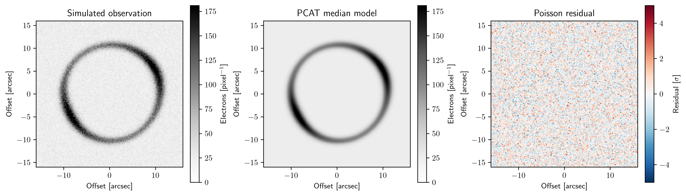

# PCAT

## Purpose

PCAT is a Bayesian framework for inferring catalogs and physical models from
Poisson-distributed images, photon events, and spectra. Its transdimensional
sampler infers the number of sources together with their properties. The same
sampling, persistence, and visualization pipeline also supports fixed-dimensional
models with user-defined likelihoods.

Primary use cases include

- probabilistic source catalogs from images and photon-count data
- transdimensional inference over source populations
- crowded-field detection and membership uncertainty
- strong-lens and substructure forward modeling
- spectral-line decomposition
- fixed-dimensional physical models with custom likelihoods

Daylan, Portillo, and Finkbeiner (2017) introduced the core method for gamma-ray
point-source populations. The maintained examples extend the framework to
Gaussian mixtures, strong gravitational lenses, spectral lines, catalog
association, and detector point-spread functions.

## Posterior samples


Each frame combines posterior draws from simulated Gaussian-mixture,
point-source, strong-lens, and spectral-line analyses. The synchronized panels
show how one inference and visualization pipeline spans distinct data models.
These controlled simulations are not measurements of observed systems.

## Catalog inference

PCAT compares configurations with different numbers of sources, samples source
and population parameters jointly, quantifies detection and membership
probabilities, and evaluates posterior predictions against the input data.

Fixed-dimensional models with custom likelihoods use the same proposal,
acceptance, persistence, convergence, and final-processing pipeline as
transdimensional catalog models:

```python
from pcat.main import sample

result = sample(
	typeexpr="gener",
	retr_llik=log_likelihood,
	parameter_names=("mean", "scale"),
	prior_types=("self", "gaus"),
	prior_minima=(-5.0, 0.0),
	prior_maxima=(5.0, 5.0),
	prior_means=(0.0, 1.0),
	prior_stdvs=(1.0, 0.2),
	initial_values=(0.0, 1.0),
	proposal_scales=(0.05, 0.05),
	proposal_correlation=((1.0, 0.3), (0.3, 1.0)),
	pathbase="/path/to/project-root",
	strgcnfg="fixed-example",
)
```

``"self"`` parameters have uniform priors between their minima and maxima;
``"gaus"`` parameters use the specified means and standard deviations. PCAT
proposes in unit-prior coordinates and applies its existing inverse-CDF
transforms. Generic runs set birth/death and split/merge probabilities to zero,
so only the native type-0 within-model proposal is active. The returned object
is the normal persisted ``gdatfinlpost`` state.

By default, type-0 moves perturb one parameter at a time. Set
``probpropblock`` above zero to mix in correlated block moves using
``proposal_correlation``; ``factpropblock`` scales those block increments.
These moves retain PCAT's standard acceptance, adaptation, persistence, and
final-processing machinery.

## Installation

A modern installation path is:

```bash
cd /path/to/pcat
pip install -e .
export PCAT_PATH=/path/to/pcat
```

`PCAT_PATH` identifies the Git repository root. Its `data/` and `visuals/` directories are ignored by Git. The separate `PCAT_DATA_PATH` variable remains the working-data and pipeline-output root used by scientific runs.

This repository expects the shared library `tdpy` to be installed in the same Python environment. For local development, this is usually easiest with:

```bash
cd /path/to/tdpy
pip install -e .
cd /path/to/pcat
pip install -e .
```

## Roman strong-lens catalogs

The executable example uses the compact PCAT Roman benchmark to simulate 100 strong-lens images. Half contain one dark-matter perturber drawn at a candidate position around the macro Einstein ring, and half contain no perturber. The catalog approximation compares zero- and one-perturber models after Roman point-spread-function convolution and Poisson plus read noise. Its diagnostic follows one representative lens from simulated detector input through the macro-only model and residual, then summarizes the final population-level catalog probabilities.

```bash
python examples/roman_lens_catalog/roman_lens_catalog_diagnostic.py --typefileplot png
```


For the fixed seed, the approximate catalog classifier recovers 38% of injected perturbers above a posterior threshold of 0.5, with a 68% Wilson interval of 31% to 45%. It produces no false positives among the 50 null lenses, with an upper interval bound of 2%, and localizes 84% of injected perturbers to the correct candidate position. The mean one-perturber posterior probability is 0.37 for injected systems and $4.6\times10^{-5}$ for null systems. These values characterize this clearly labeled simulation and are not forecasts from real Roman observations.

Full transdimensional runs initialize a model configuration, define a likelihood and data product, and call `pcat.main.init(...)` with a populated configuration dictionary.

## Rubin-like cluster lens

The interactive
[`rubin_cluster_lens.ipynb`](examples/rubin_cluster_lens/rubin_cluster_lens.ipynb)
notebook fits a synthetic, single-band image of a circular cluster-scale lens.
The simulation uses 0.2 arcsec pixels and 0.7 arcsec Gaussian seeing. PCAT
samples the Einstein radius and two source coordinates with a Poisson image
likelihood.



The example fixes the source morphology, total brightness, sky background, and
seeing at their injected values. It omits foreground galaxy light, neighboring
cluster members, correlated sky noise, and point-spread-function uncertainty.
The figure therefore demonstrates parameter recovery in a controlled simulation
rather than a forecast for Rubin Observatory or an analysis of observed data.

## Daylan et al. 2017 reproduction

The synthetic reproduction of the original PCAT point-source analysis is in
[`examples/Daylan+2017`](examples/Daylan+2017). It preserves the published 300-source
population and flux-distribution slope while clearly separating this scaled,
self-contained run from the archival Fermi-LAT data analysis.

## Outputs

PCAT writes serialized posterior states under `data/` and figures under
`visuals/`, rooted at the configured run directory. Products include input data,
posterior model realizations, residuals, inferred source populations, parameter
distributions, convergence summaries, and animations. Example-specific figures
remain beside their workflows under `examples/*/visuals/`.

## Posterior plotting

PCAT can render every one- and two-parameter posterior projection without an
external corner-plot package:

```python
from pcat import plot_grid

plot_grid(
	"/path/to/posterior",
	"model",
	result.listpostparagenrscalbase,
	("mean", "scale"),
	typefileplot="pdf",
)
```

## Fixed-dimensional evidence

`pcat.diagnostics.estimate_evidence` estimates the marginal likelihood for a
fixed-dimensional PCAT run with normalized bounded (`self`) or Gaussian (`gaus`)
priors. It fits a proposal to posterior draws and evaluates the likelihood on
independent draws from a mixture of that proposal and the prior:

```python
from pcat.diagnostics import estimate_evidence

evidence = estimate_evidence(
    result.listpostparagenrscalbase,
    lambda values: -0.5 * ((values[0] - 0.3) / 0.1) ** 2,
    prior_types=('self',),
    prior_minima=(0.0,),
    prior_maxima=(1.0,),
)
print(evidence['log_evidence'], evidence['relative_error'])
```

The result also includes `effective_sample_size`. The relative error describes
Monte Carlo uncertainty in the evidence, approximately the uncertainty in log
evidence when small. Repeat the estimate with more draws if the effective sample
size is low. A custom prior needs its normalized density and sampling rule before
evidence can be estimated this way.

## Documentation

The user guide begins at [`docs/index.rst`](docs/index.rst) and covers
installation, runnable examples, output products, diagnostics, and the public
API. Build the HTML documentation with:

```bash
python -m pip install -e ".[docs]"
python -m sphinx -E -a -W --keep-going -b html docs docs/_build/html
```

## References

- Daylan, Portillo, and Finkbeiner (2017), *Inference of Unresolved Point Sources at High Galactic Latitudes Using Probabilistic Catalogs*, The Astrophysical Journal, 839, 4
