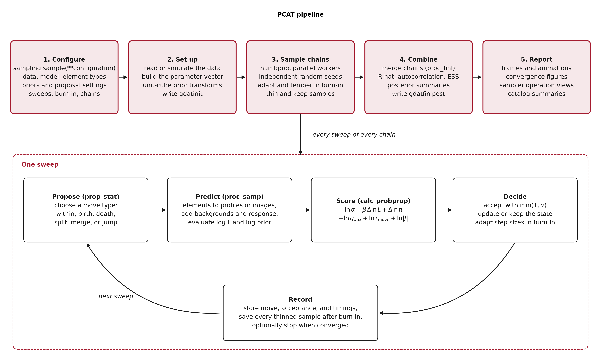
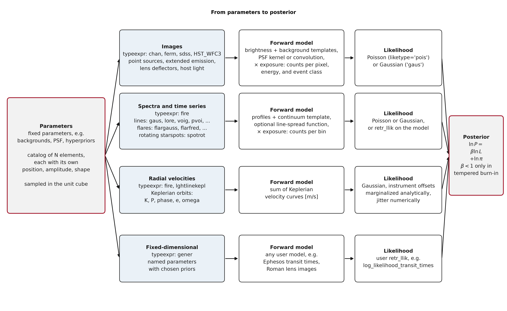
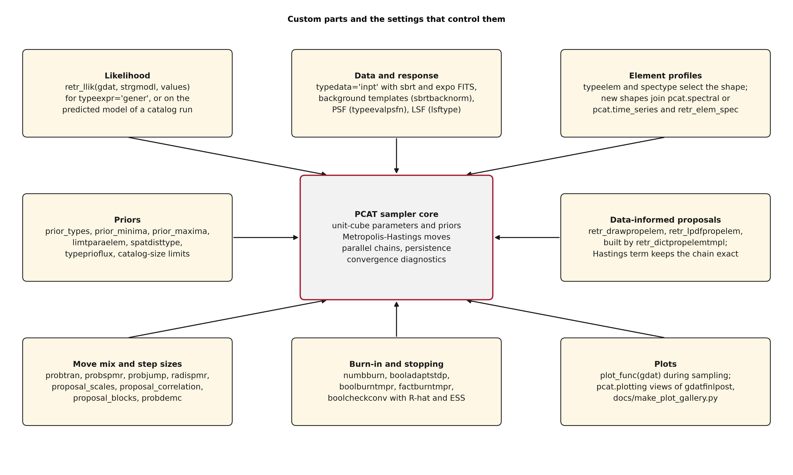

How PCAT works
==============

These schematics summarize how a run proceeds, how each data family becomes a
likelihood, and which parts of PCAT a user can replace or tune. Regenerate them
with ``python docs/make_diagrams.py``; the script fails if any label overflows
its box.

Pipeline
--------

A call to :func:`pcat.sampling.sample` configures the run, sets up the data and
the parameter vector, samples ``numbproc`` independent chains, combines them,
and writes the reports described in :doc:`outputs`. Every sweep of every chain
proposes one move, predicts the data, scores the Metropolis-Hastings ratio,
accepts or rejects the candidate, and records the outcome. :doc:`sampling`
defines each move and each term of the ratio.

Likelihoods
-----------

The same parameter vector, fixed parameters plus a catalog of elements, feeds
one forward model per data family. The likelihood of the predicted data and
the prior form the posterior; the likelihood is tempered only during an
optional tempered burn-in. :doc:`likelihoods` documents each family and its
settings.

Custom parts
------------

The sampler core handles priors, moves, chains, persistence, and diagnostics.
Around it, the likelihood, data and response, element profiles, priors,
data-informed proposals, move mix, burn-in and stopping rules, and plots can be
supplied or tuned through the settings named in each box. :doc:`api` documents
the corresponding functions.

