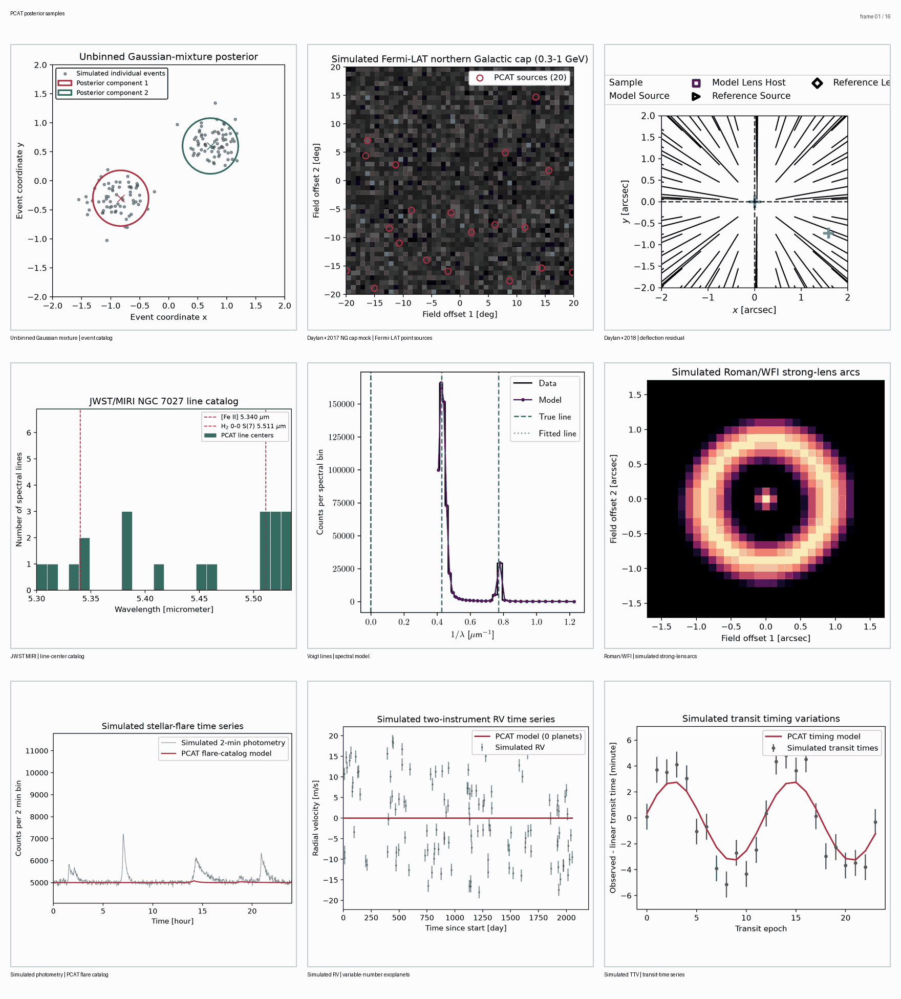

Examples
========

Every Python example under ``examples/`` has a corresponding Jupyter notebook
in the same directory. Open the notebook in VS Code or Jupyter to run it
interactively. The Python scripts remain available for automated and command-line
runs. The batch-command notebook lists its external commands without executing
them.

Pipeline demonstrations
-----------------------

``chan_demo``
   Compact Chandra-style point-source detection with simulated data.

``gmix_demo``
   Two-dimensional variable-width Gaussian-mixture inference with genuine
   birth and death transitions.

``hst_lens``
   Hubble Space Telescope Wide Field Camera 3 image inference with lens mass,
   foreground lens-galaxy emission, source emission, and lensed emission.

   .. code-block:: bash

      python examples/hst_lens/generate_demo.py

``rubin_cluster_lens``
   Simulated Rubin-like cluster-scale lens with a Gaussian point-spread function.
   The notebook samples the Einstein radius and source position with PCAT's
   Poisson image likelihood, then shows the fitted image, residuals, and
   posterior parameter distributions. It does not analyze Rubin observations.

``rubin_dp1_observed_lenses``
   Rubin Science Platform notebook for real Data Preview 1 imaging. It queries
   confirmed SIMBAD lens-system classifications, checks exact DP1 image
   footprints, retrieves every resulting deep-coadd cutout, displays the full
   matched sample, and passes each usable cutout to PCAT. DP1 requires Rubin
   data rights, and SIMBAD does not constitute a complete census of lenses.

Run the image analyses, Roman benchmark, and reduced Voigt calculation with:

.. code-block:: bash

   python examples/run_examples.py

Posterior samples from four maintained examples are synchronized below. The
panels show model intensity for a Gaussian mixture, model counts for point
sources and a strong lens, and the model with data for spectral lines.

Publication and instrument examples
-----------------------------------

``Daylan+2017``
   Scaled mock-catalog reproduction of Daylan, Portillo, and Finkbeiner (2017).
   The smoke mode preserves the inference pattern while reducing the source
   count and chain length.

   .. code-block:: bash

      python 'examples/Daylan+2017/generate_reproduction.py' --smoke --fresh

``Daylan+2018``
   Simulated Hubble Space Telescope Wide Field Camera 3 strong-lens analysis
   comparing a variable subhalo catalog with a fixed one-subhalo fit.

   .. code-block:: bash

      python 'examples/Daylan+2018/generate_reproduction.py' --smoke
      python 'examples/Daylan+2018/generate_reproduction.py' --smoke --one-subhalo

``voigt-profile``
   Transdimensional detection of an unknown number of Voigt-profile emission
   lines in simulated spectral data.

   .. code-block:: bash

      python examples/voigt-profile/pcat_voigt_profile_detection.py --configuration nomi

``roman_lens_catalog``
   Seeded Roman strong-lens population benchmark and catalog-detection
   diagnostic.

   .. code-block:: bash

      python examples/roman_lens_catalog/roman_lens_catalog_diagnostic.py

   .. image:: ../examples/roman_lens_catalog/visuals/roman_lens_catalog_diagnostic.png
      :alt: Simulated Roman strong-lens images, residual, and catalog posterior
      :width: 720px
      :align: center

   The four panels trace one simulated detector image through the macro-lens
   model and residual, then summarize catalog posterior probabilities across
   the seeded lens population.

``fermi_lat_pg1553``
   Fermi Large Area Telescope event-filter configuration for PG 1553+113. This
   utility requires the Fermi Science Tools and local mission data.

Analysis utilities
------------------

``catalog_association``
   Seeded completeness and purity calculation for coordinate-and-value catalog
   matching across a range of association radii.

   .. code-block:: bash

      python examples/catalog_association/catalog_association.py

   .. image:: ../examples/catalog_association/visuals/catalog_association.png
      :alt: Catalog completeness and purity across association radii
      :width: 640px
      :align: center

``psf_subpixel``
   Reconstruction of an oversampled point-spread function with PCAT's
   piecewise-cubic detector-pixel model, including interpolation residuals.

   .. code-block:: bash

      python examples/psf_subpixel/psf_subpixel.py

   .. image:: ../examples/psf_subpixel/visuals/psf_subpixel.png
      :alt: Cubic subpixel point-spread-function reconstruction and residuals
      :width: 640px
      :align: center

Scientific interpretation
-------------------------

Generated examples are deterministic pipeline demonstrations unless their
README explicitly states otherwise. Synthetic outputs validate computation and
visualization but do not constitute measurements of real astrophysical systems.
The Daylan+2017 README distinguishes its scaled simulation from the
archival Fermi-LAT analysis in the publication.