Plotting gallery
================

Each figure below is an unedited output of one public plotting routine. Run
``python docs/make_plot_gallery.py`` to regenerate all of them. The
transdimensional figures come from a four-chain PCAT run on the simulated
two-line Voigt spectrum of ``examples/voigt_spectral_line_catalog`` (20,000
sweeps per chain, half discarded as burn-in), the fixed-dimensional figures from
a four-chain run on a correlated bivariate Gaussian, and the lens figures from
the simulated Roman/WFI strong-lens benchmark. All data are simulated.

Sampler operation
-----------------

:func:`pcat.plotting.plot_sampler_overview` writes every view in this section
and the next that applies to a run; :func:`pcat.sampling.sample` calls it for
each run with final plots enabled.

:func:`pcat.plotting.plot_proposal_ledger` follows each move type through
burn-in and sampling and summarizes its acceptance after burn-in.

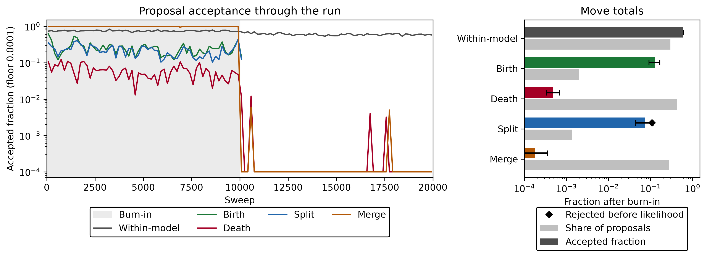

:func:`pcat.plotting.plot_acceptance_decomposition` splits each log
acceptance ratio into the posterior change, the move-selection ratio, and the
split/merge Jacobian.

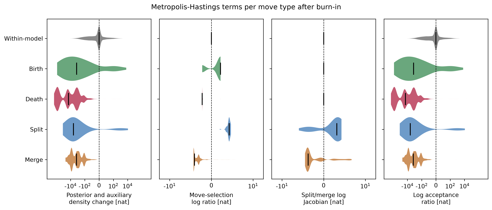

:func:`pcat.plotting.plot_compute_budget` locates where each move spends its
wall time.

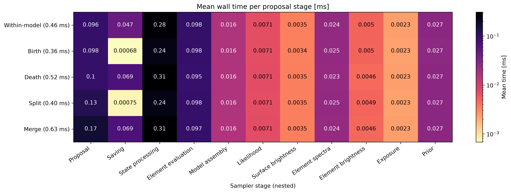

Catalogs and fits
-----------------

:func:`pcat.plotting.plot_catalog_trace` draws every element of every retained
catalog of one chain, so births, deaths, splits, and merges appear as tracks.

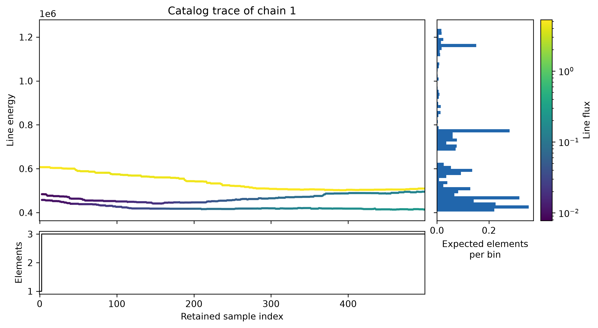

:func:`pcat.plotting.plot_posterior_predictive` compares the data with data
replicated from the posterior.

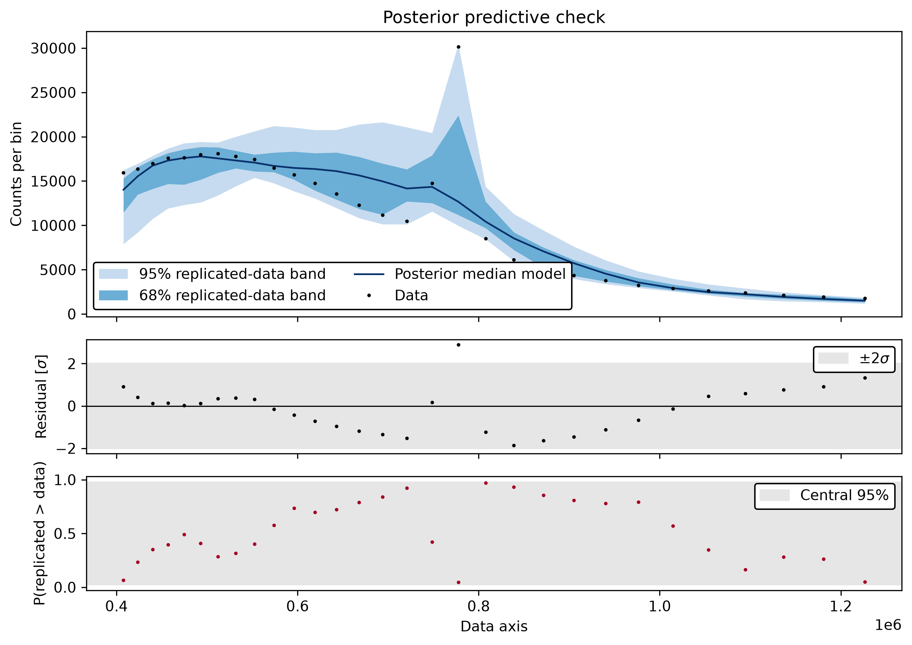

:func:`pcat.plotting.plot_lens_image_fit` and
:func:`pcat.plotting.plot_lens_parameter_recovery` summarize one simulated
Roman/WFI lens fit.

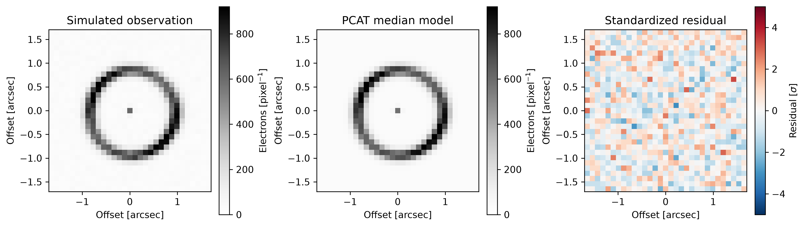

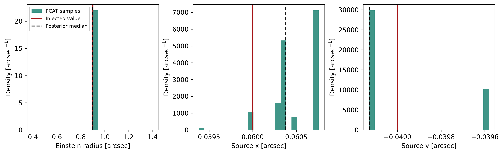

:func:`pcat.plotting.plot_detection_diagnostic` summarizes perturber detection
over a simulated lens population.

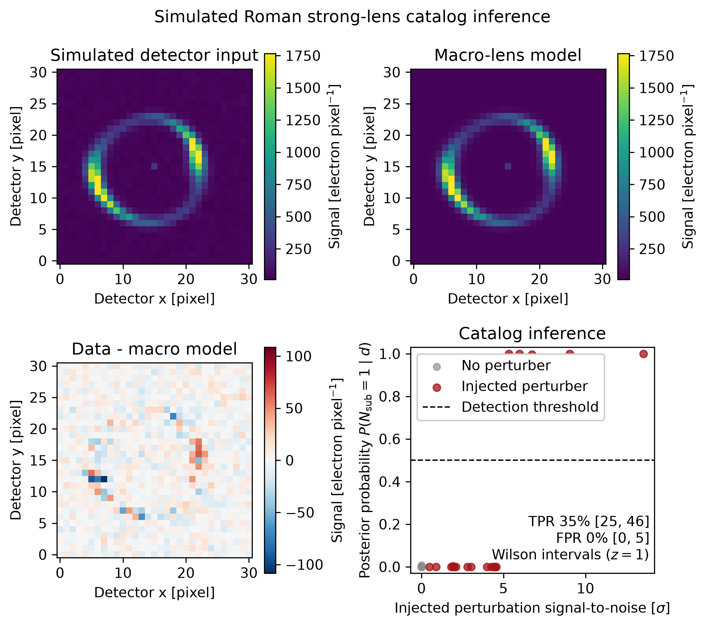

Convergence
-----------

:func:`pcat.plotting.plot_posterior_convergence` writes one set of figures per
run. The transdimensional run adds catalog-size diagnostics.

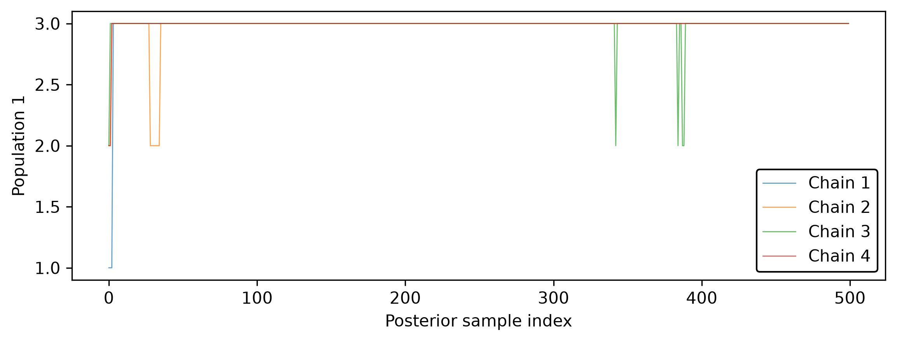

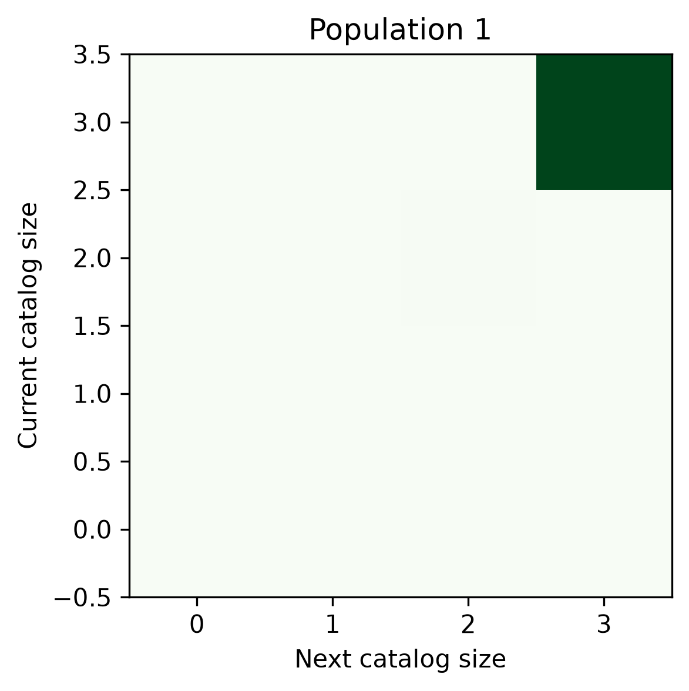

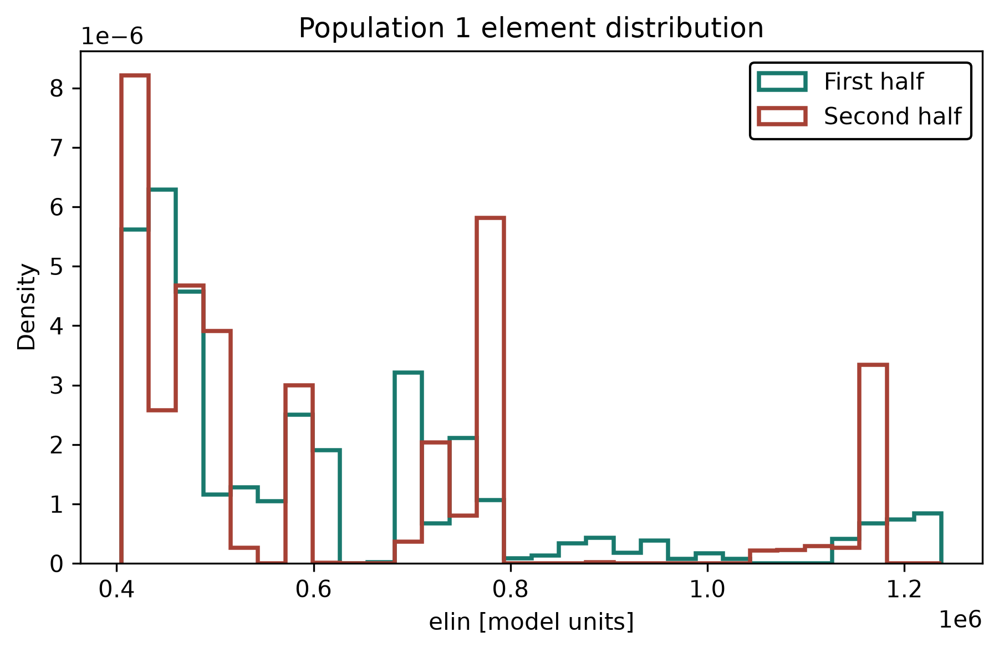

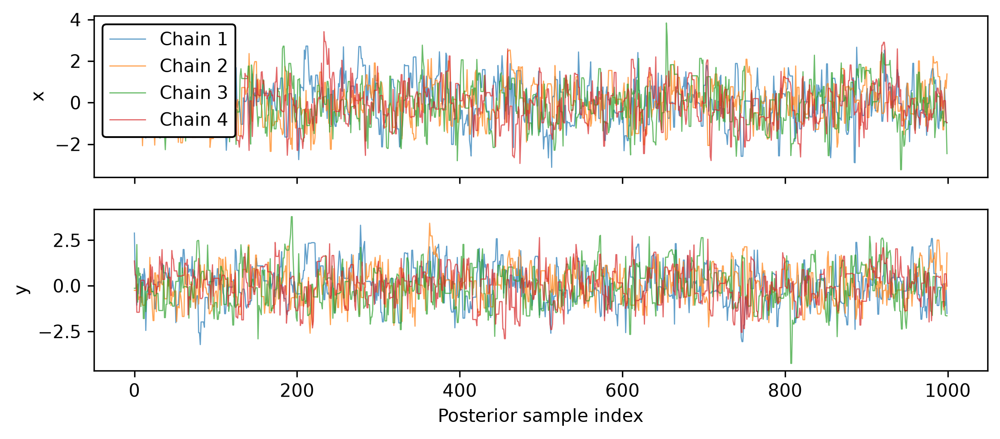

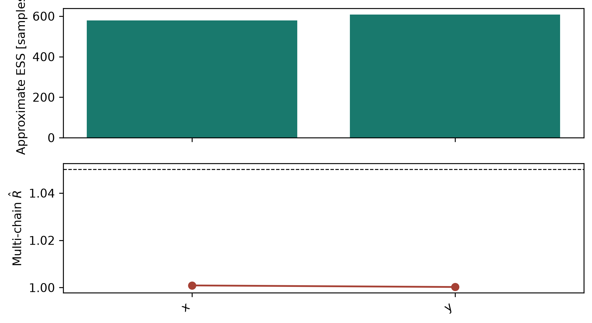

:func:`pcat.plotting.plot_gelman_rubin` histograms the potential scale
reduction factor of the model in every data bin, and
:func:`pcat.plotting.plot_autocorrelation` plots one autocorrelation sequence.

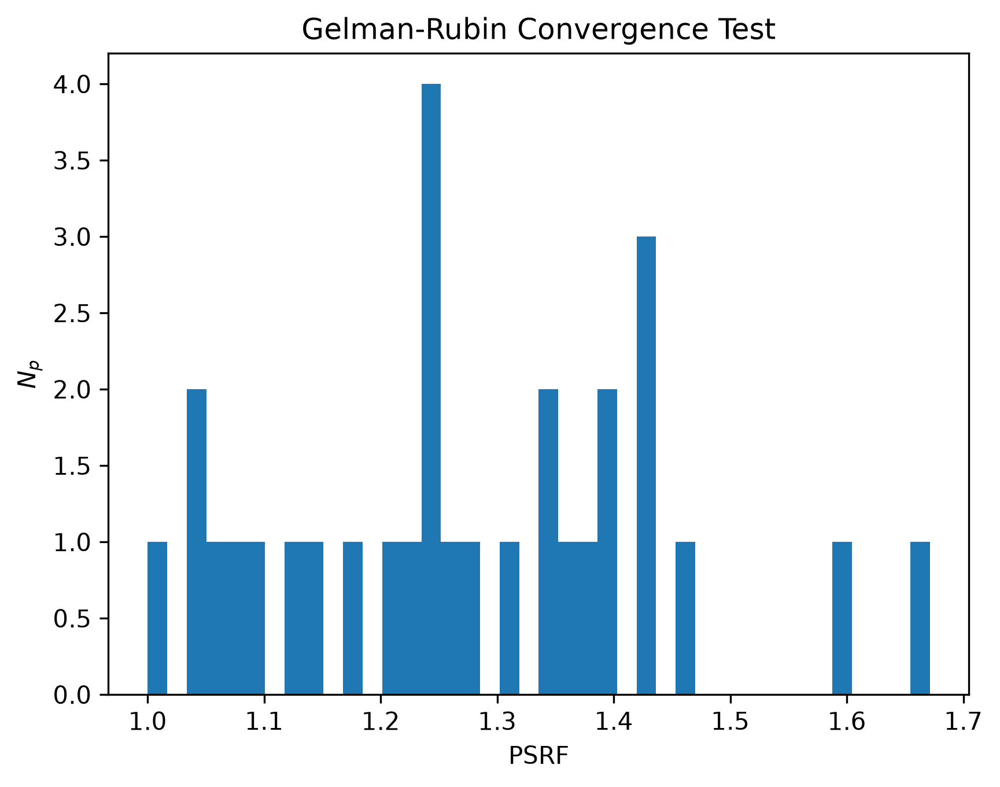

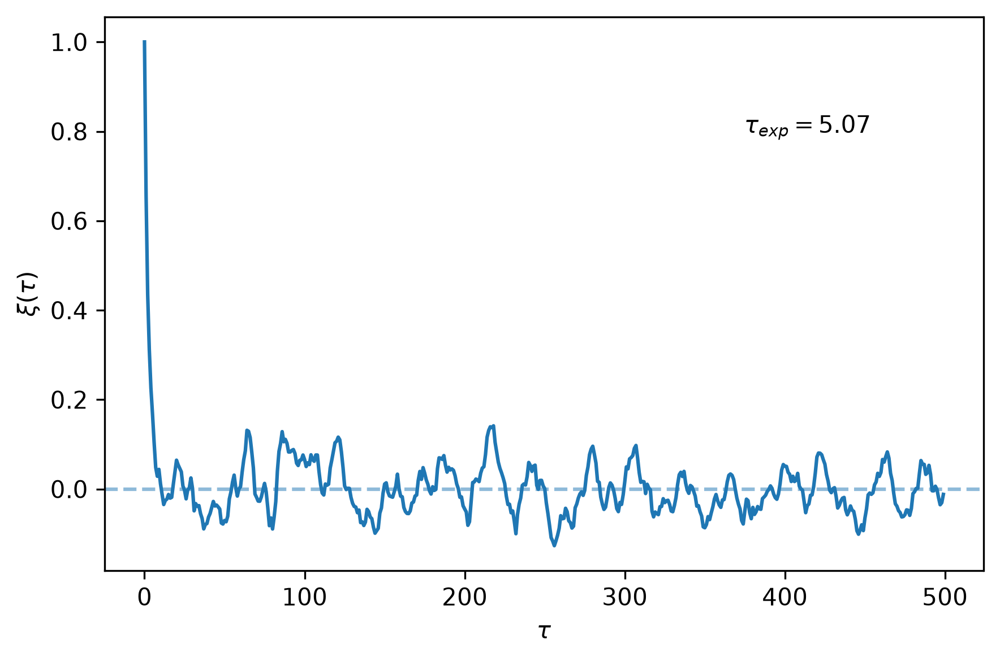

Posterior projections
---------------------

:func:`pcat.plotting.plot_grid` draws all one- and two-parameter projections,
here with the injected values marked.

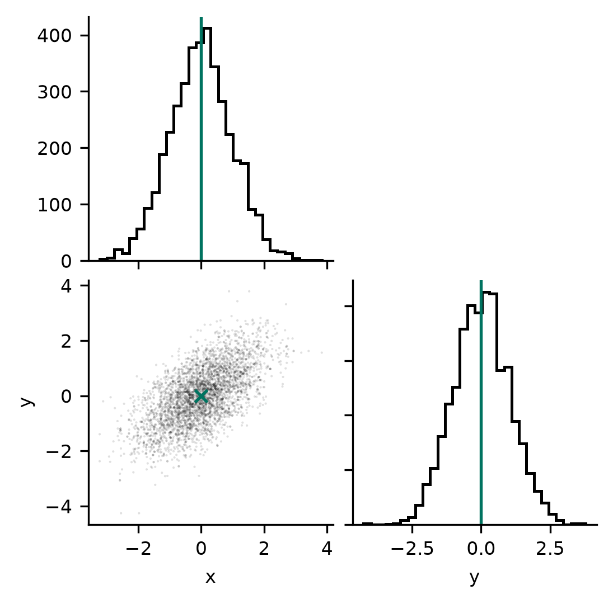

:func:`pcat.plot_population_grid` compares labeled sample populations.

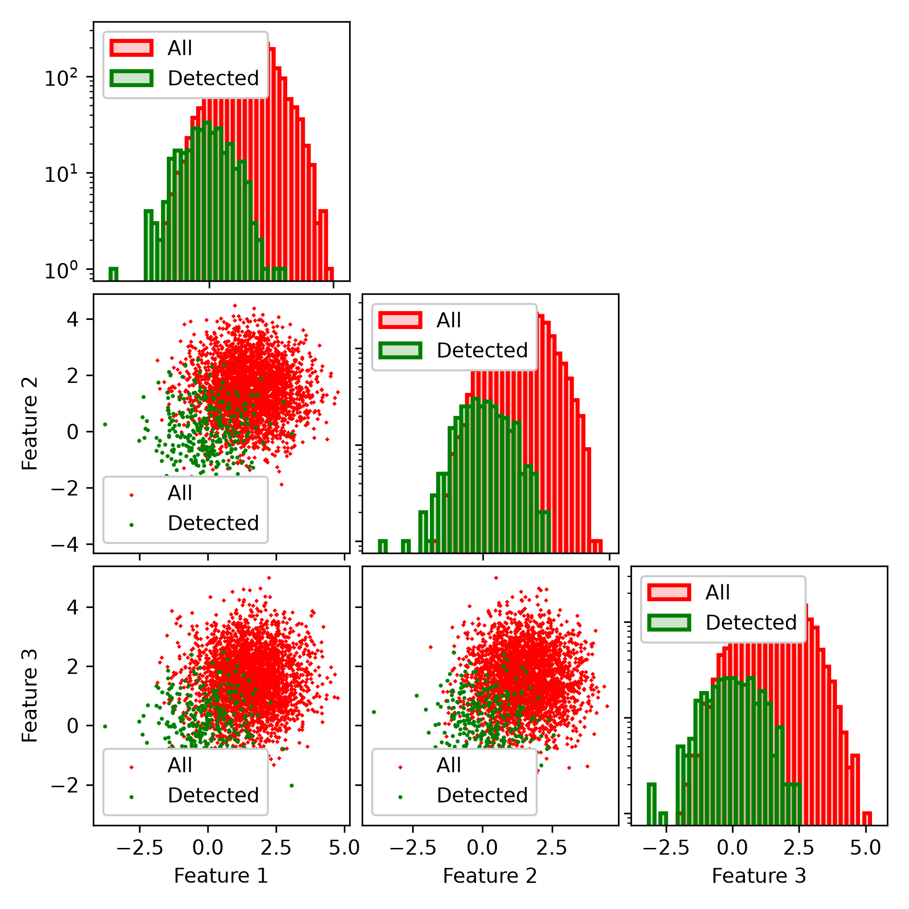

Animations
----------

:func:`pcat.plotting.make_image_sequence_animation` animates images with a
shared stretch, here lensed arcs from six posterior draws.

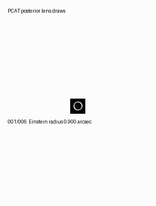

:func:`pcat.plotting.make_posterior_animation_collage` combines the posterior
frames of several examples; ``examples/run_all_examples.py`` writes the
collage shown on the :doc:`index` page.

.. image:: ../examples/pcat_posterior_samples.gif
   :alt: Collage of posterior frames from several examples
   :width: 100%
