# PCAT example figures

These notebooks apply probabilistic cataloging to point-source images, Gaussian mixtures, strong gravitational lenses, diffuse emission, and Voigt spectral lines. They also demonstrate catalog association. Open a notebook in each directory and run its code cells to see selected data, model, residual, and posterior figures inline. The matching Python scripts remain available for command-line automation and existing tests. The Fermi-LAT filter and manual batch-command notebooks have no generated figures to display.

Sampler runs write a `proposal_activity.gif` with cumulative attempt and acceptance counts for each move type. Runs with model frames also write a `proposal_sequence.gif` that labels each frame with its proposal and acceptance status.

Set `boolmakeanimprop=True` for a third product, `proposal_candidates.gif`, which shows every candidate before the accept/reject decision. It includes rejected candidates and is therefore a proposal diagnostic rather than a posterior-sample animation. The `proposal_state_animation/` notebook runs a short simulated Voigt-line example and displays the retained-state and every-candidate animations together.

## Publication coverage

| Publication | PCAT application | Example | Scope |
| --- | --- | --- | --- |
| Daylan et al. (2017), [10.3847/1538-4357/aa679e](https://doi.org/10.3847/1538-4357/aa679e) | Fermi-LAT point-source populations | `daylan+2017_fermi_point_sources/` | Scaled synthetic analog |
| Portillo et al. (2017), [10.3847/1538-3881/aa8565](https://doi.org/10.3847/1538-3881/aa8565) | Crowded SDSS M2 field | `portillo+2017_crowded_sdss_m2/` | Scaled synthetic analog |
| Daylan et al. (2018), [10.3847/1538-4357/aaa1f2](https://doi.org/10.3847/1538-4357/aaa1f2) | Strong-lens subhalo catalogs | `daylan+2018_strong_lens_subhalos/` | Scaled synthetic analog |
| Feder et al. (2020), [10.3847/1538-3881/ab74cf](https://doi.org/10.3847/1538-3881/ab74cf) | Multiband SDSS deblending | `feder+2020_multiband_sdss_deblending/` | Scaled synthetic analog |
| Butler et al. (2022), [10.3847/1538-4357/ac6c04](https://doi.org/10.3847/1538-4357/ac6c04) | SPIRE CIB, cirrus, and rSZ separation | `butler+2022_spire_sz_component_separation/` | Scaled synthetic analog |
| Feder et al. (2023), [10.3847/1538-3881/ace69b](https://doi.org/10.3847/1538-3881/ace69b) | SPIRE point-plus-diffuse inference | `feder+2023_point_diffuse_spire/` | Scaled synthetic analog |
| Hall et al. (2026), [10.3847/1538-4357/ae1e7a](https://doi.org/10.3847/1538-4357/ae1e7a) | Herschel DSFG multiplicity | `hall+2026_herschel_dsfg_multiplicity/` | Scaled synthetic analog |

These examples showcase the PCAT model families used by the papers. They do not claim numerical reproduction unless the paper inputs and converged sampling configuration are explicitly supplied.

## Layout

- `gaussian_mixture_catalog/`: transdimensional inference of a compact Gaussian mixture
- `chandra_point_source_catalog/`: point-source inference in a simulated Chandra-style image
- `daylan+2017_fermi_point_sources/`: a 300-source synthetic analog of the mock analysis in Daylan et al. (2017)
- `daylan+2018_strong_lens_subhalos/`: a simulated HST strong-lens catalog and one-subhalo comparison inspired by Daylan et al. (2018)
- `portillo+2017_crowded_sdss_m2/`: a scaled crowded-field SDSS catalog analysis inspired by Portillo et al. (2017)
- `feder+2020_multiband_sdss_deblending/`: five-band SDSS probabilistic deblending inspired by Feder et al. (2020)
- `butler+2022_spire_sz_component_separation/`: point-source and diffuse-template separation inspired by Butler et al. (2022)
- `feder+2023_point_diffuse_spire/`: three-band point-plus-diffuse inference inspired by Feder et al. (2023)
- `hall+2026_herschel_dsfg_multiplicity/`: crowded three-band source multiplicity inspired by Hall et al. (2026)
- `simulated_hst_strong_lens/`: catalog inference in a simulated Hubble Space Telescope lens image
- `roman_strong_lens_perturber_catalog/`: a seeded Roman strong-lens benchmark and its generated diagnostic
- `simulated_rubin_cluster_lens/`: a synthetic Rubin-like cluster-scale lens fitted with PCAT's Poisson image sampler
- `rubin_dp1_confirmed_strong_lenses/`: an RSP-only workflow that crossmatches confirmed SIMBAD lens systems to real Rubin DP1 imaging, retrieves all catalog-footprint matches, and runs demonstration PCAT fits
- `catalog_association_completeness_purity/`: completeness and purity across catalog-matching radii
- `voigt_spectral_line_catalog/`: nominal and high-signal Voigt-profile line detection in simulated spectra
- `jwst_miri_ngc7027_line_catalog/`: transdimensional emission-line catalog of the planetary nebula NGC 7027 from a real JWST MIRI MRS spectrum
- `variable_number_stellar_flares/`: transdimensional catalog of a variable number of stellar flares in a simulated photometric time series
- `proposal_profiling/`: execution time, prior-support fraction, and acceptance of each proposal type on the simulated Voigt spectrum
- `proposal_state_animation/`: retained chain states and every attempted proposal from the same simulated Voigt-line run
- `burn_in_strategies/`: fixed, adaptive, and likelihood-tempered burn-in on correlated and bimodal simulated targets
- `sampler_comparison_emcee_dynesty/`: PCAT, emcee, and dynesty on one simulated sinusoid posterior
- `population_grid/`: corner, histogram, and pair plots of two simulated sample populations
- `fermi_lat_pg1553_event_filter/`: a Fermi Large Area Telescope event-filter configuration for PG 1553+113

## Emission lines of NGC 7027 in a JWST MIRI spectrum

The input is the public level-3 JWST Mid-Infrared Instrument (MIRI) Medium Resolution Spectrometer (MRS) spectrum of the planetary nebula NGC 7027 from program 1523 (channel 1 short, file `jw01523-o001_t002_miri_ch1-short_x1d.fits`), which the script downloads from MAST. PCAT fits 5.30 to 5.535 &mu;m, 294 wavelength bins, with a variable number (0 to 25) of Voigt emission lines on top of a continuum template. The template is a running median of the spectrum with lines iteratively masked. PCAT's likelihood is Poisson, so each bin's flux density is converted to effective counts whose Poisson variance equals the pipeline uncertainty plus a 1% floor for calibration and fringe residuals.

The chain shown has 19 (+1/&minus;2) lines. Six lines appear in every sampled catalog: [Fe II] 5.340 &mu;m, H<sub>2</sub> 0&ndash;0 S(7) 5.511 &mu;m, and unidentified lines at 5.380, 5.449, 5.459, and 5.525 &mu;m. A line at 5.374 &mu;m appears in 45% of catalogs. H<sub>2</sub> S(7) carries 1.1 &times; 10<sup>&minus;15</sup> W m<sup>&minus;2</sup> and [Fe II] 7 &times; 10<sup>&minus;17</sup> W m<sup>&minus;2</sup>. The remaining lines are faint and sit where the fixed continuum template departs from the data, especially at the window edges, so they absorb continuum structure. The continuum amplitude is not sampled. The sampler does not fully mix between line configurations. Independent 200,000-sweep chains settle at 14 to 19 lines, differ by up to 150 in log-likelihood, and differ by 10 to 30% in bright-line fluxes. Within-chain flux uncertainties are therefore underestimated, and the H<sub>2</sub> residual reaches &minus;9&sigma; in this chain. A run takes 200,000 sweeps and 5 to 7 min on one core.

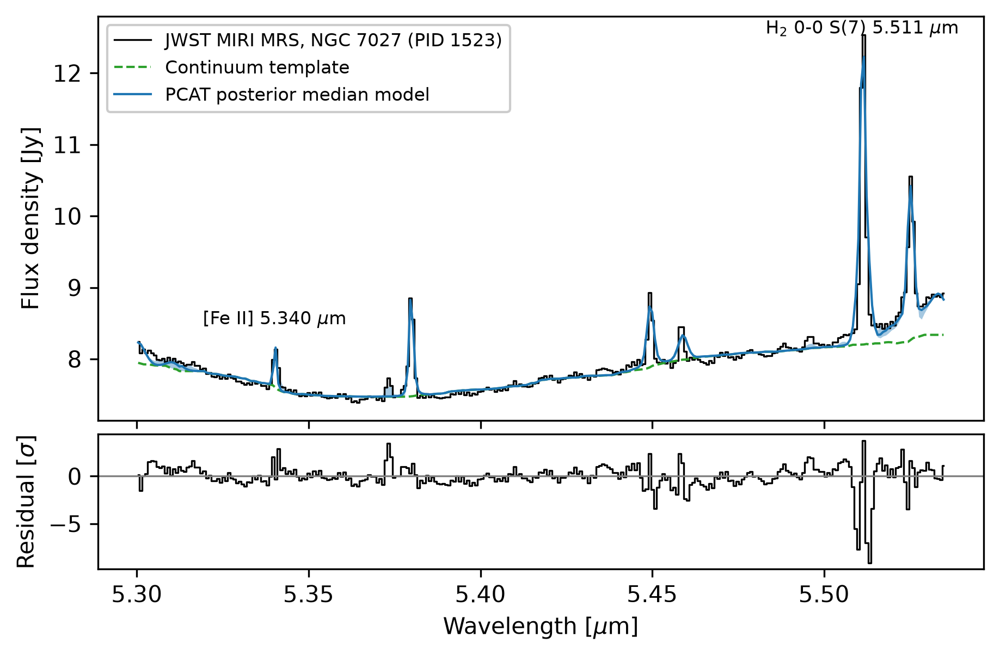

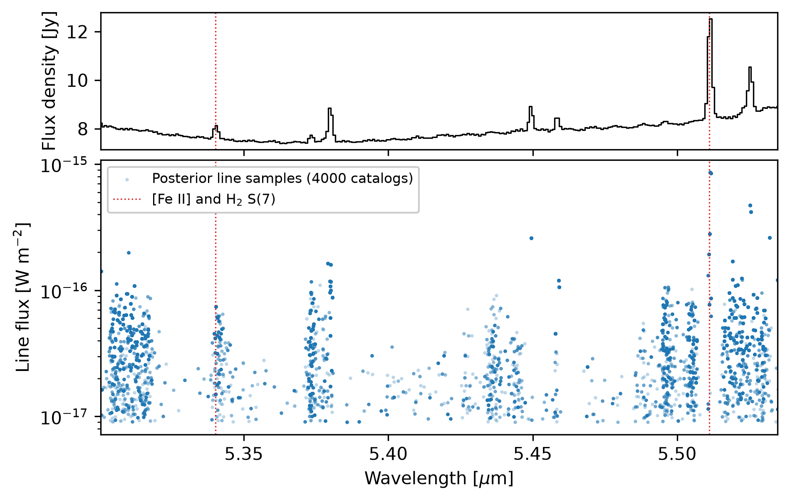

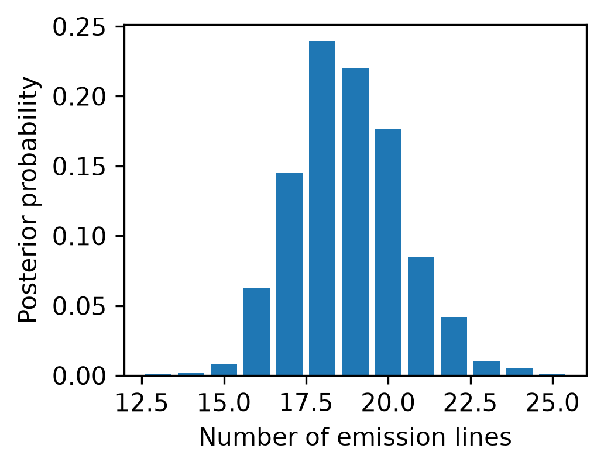

## Variable number of stellar flares

The data are simulated: a quiescent star observed at a TESS-like 2 minute cadence for 1 day, with 3 to 6 injected fast-rise, exponential-decay (FRED) flares (`nicomedia.retr_lcurmodl_flarsing`) at random peak times, amplitudes, and rise/decay time scales, and Poisson counts drawn around the expected count rate. PCAT reuses its one-dimensional element machinery for this time series. Time plays the role of the energy axis, and each flare is a native FRED component with a peak amplitude and independent rise and decay time scales on top of a fixed, flat quiescent baseline.

The inference model therefore represents the injected asymmetry directly. The catalog posterior jointly constrains the number of flares, their peak times and excess counts, and their separate rise and decay scales.

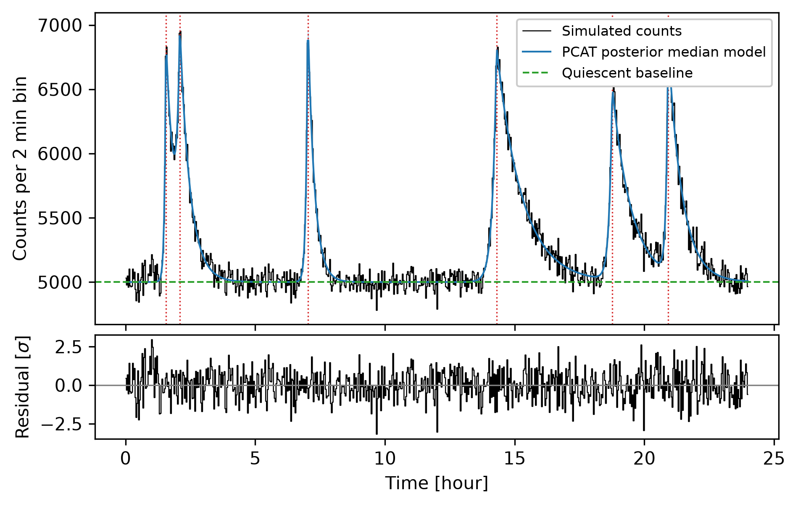

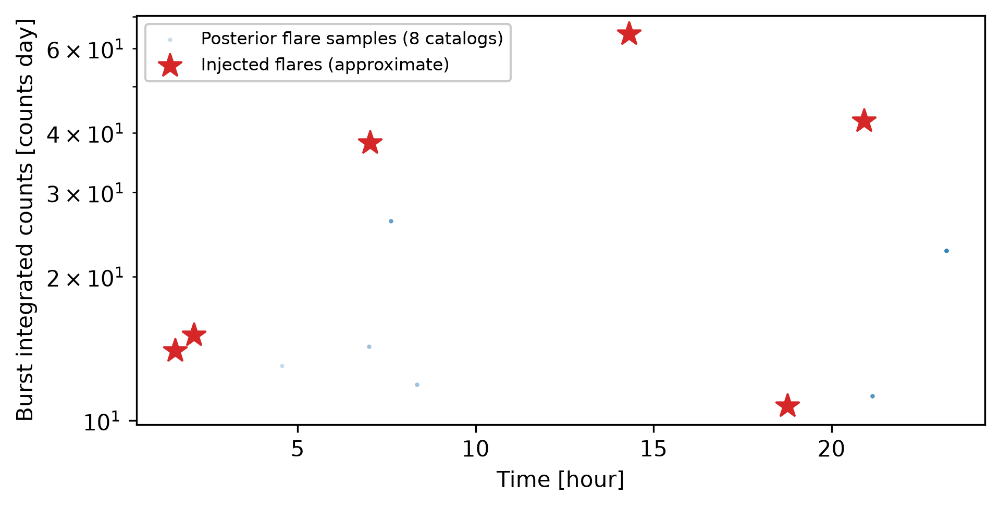

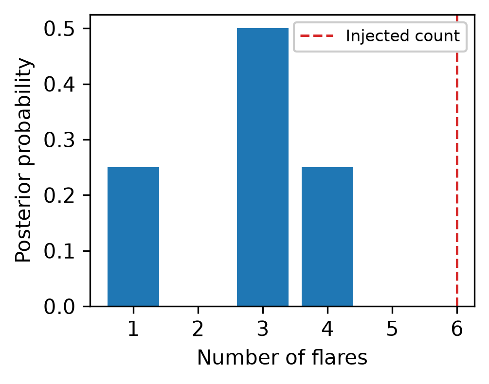

## Proposal profiling

PCAT stores the wall-clock time and proposal type of every sweep, as well as a breakdown of that time into internal pipeline phases (proposal, likelihood, model evaluation, prior, etc.). On the simulated Voigt spectrum with split and merge moves enabled (20,000 sweeps, one process, about 20 s), a within-model, birth, or death sweep takes a median of 0.28 ms, a split 0.32 ms, and a merge 0.37 ms. Acceptance is 1% for within-model, 30% for birth, 0.2% for death, 33% for split, and 5% for merge moves. The chain stays near the three-line upper bound of the fitting model although the simulation contains two lines, so death and merge proposals dominate the sweep count.

Most of the mean 0.67 ms per sweep goes to bookkeeping around the proposal (process, propose, parse, and save the state), not the physics evaluation itself (model, spectrum, and likelihood together take under 0.03 ms). A separate, tertiary bookkeeping step that runs after each sweep (not counted in the sweep total) costs 1.47 ms on average, more than twice the sweep itself, and is the clearest target for future speedups.

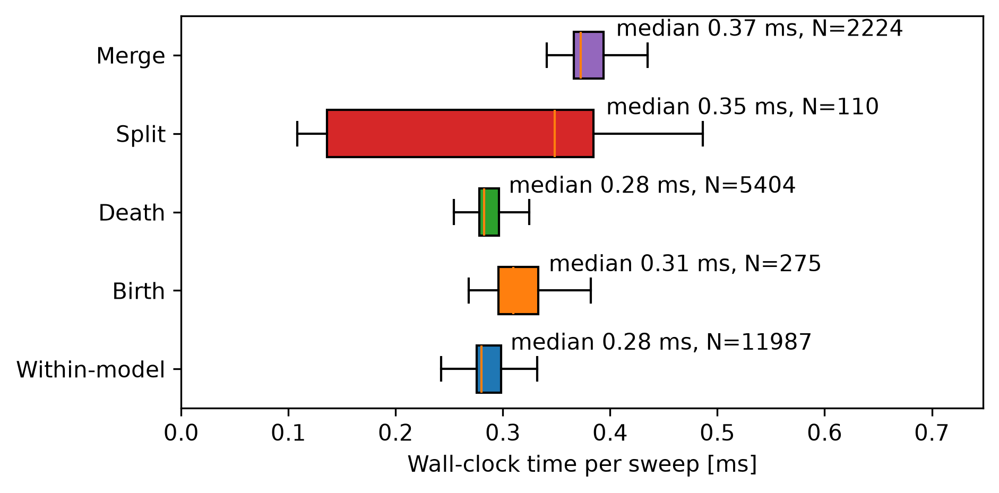

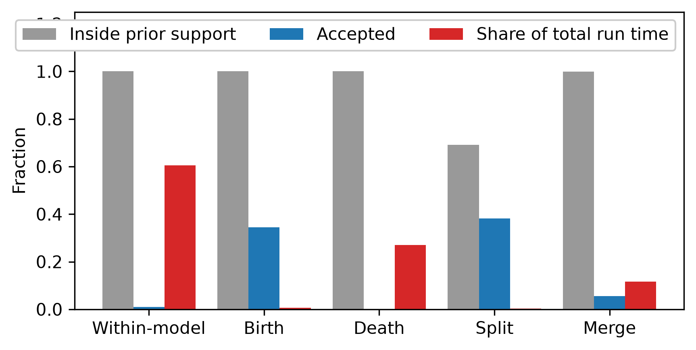

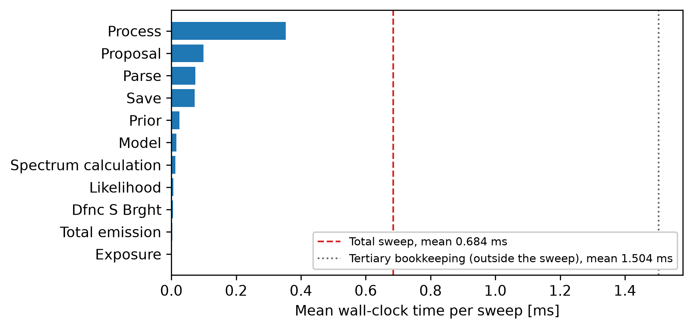

## PCAT, emcee, and dynesty

The data are simulated: 40 epochs over 30 d of a 5 m/s sinusoid with a 3.7 d period and 2 m/s noise. The three samplers share the likelihood and uniform priors on amplitude (0 to 15 m/s), period (2 to 6 d), and phase (0 to 2&pi;). PCAT (60,000 sweeps, adaptive proposal scales) and dynesty (500 live points) place all samples in the true period mode and agree on the marginal posteriors, e.g. period 3.722 &plusmn; 0.023 d. emcee (16 walkers, 4,000 steps, initialized across the prior) places 12% of its samples in secondary period modes, so its effective sample size (ESS) is not meaningful. dynesty is the most efficient on this fixed-dimensional problem, with 900 effective samples per second against 35 for PCAT, and it also returns the log-evidence, &minus;23.7 &plusmn; 0.3. PCAT evaluates the likelihood 2.6 times per sweep in this mode. Its distinct capability is transdimensional sampling, where neither emcee nor dynesty can change the number of model components within one run.

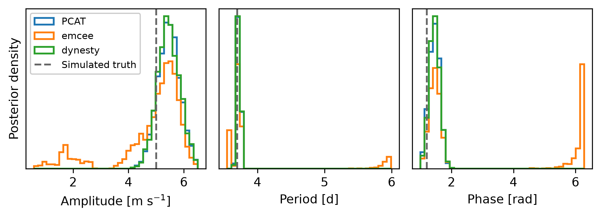

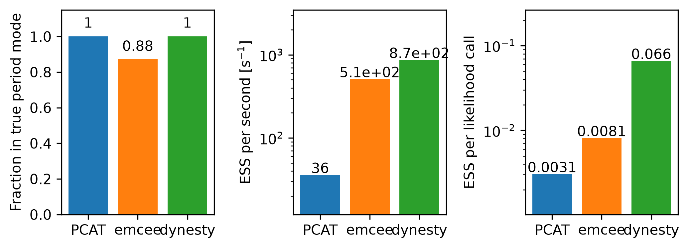

## Running

From the repository root:

```bash
cd /path/to/pcat
python examples/run_all_examples.py
```

The aggregate script replaces cached figure outputs for the included analyses. It evaluates the image analyses, the Roman strong-lens benchmark, the two utility examples, and the reduced Voigt configuration. The output includes static posterior diagnostics and posterior animations.

Run either Voigt configuration at its full sampling depth with:

```bash
python examples/voigt_spectral_line_catalog/voigt_spectral_line_catalog.py --configuration nomi
python examples/voigt_spectral_line_catalog/voigt_spectral_line_catalog.py --configuration s2nrhigh
```

The JWST example needs network access to MAST on its first run and `astroquery`:

```bash
python examples/jwst_miri_ngc7027_line_catalog/jwst_miri_ngc7027_line_catalog.py
```
