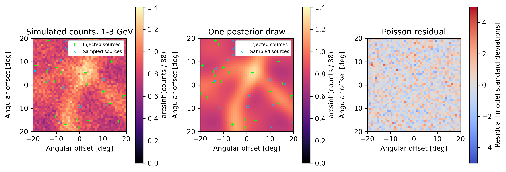
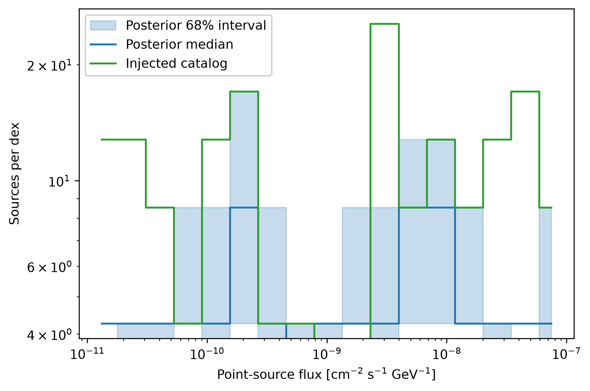
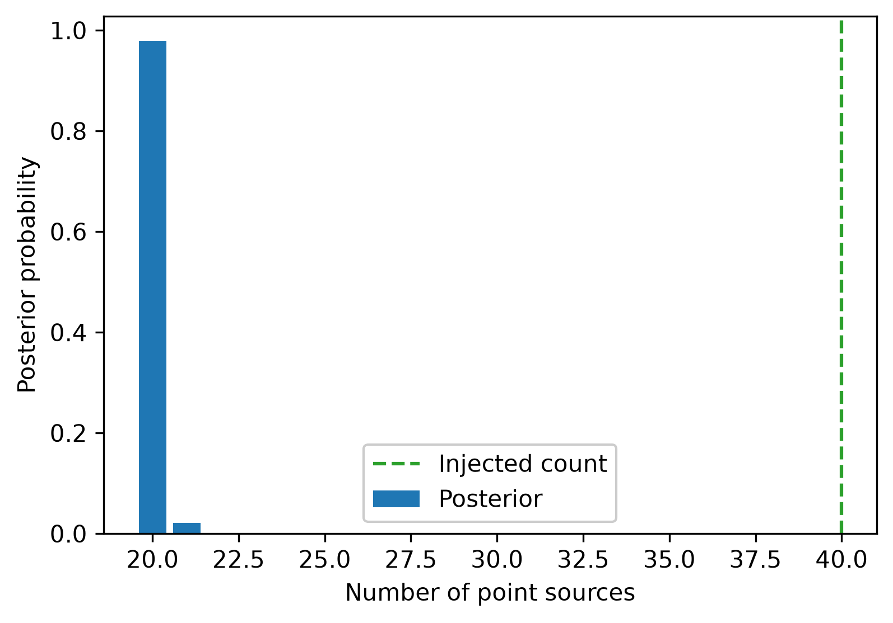

# Daylan et al. 2017 point-source mock analysis

This synthetic analysis follows the mock-run setup in
[Daylan, Portillo, and Finkbeiner (2017)](https://doi.org/10.3847/1538-4357/aa679e),
ApJ 839, 4. It samples a 300-source population with flux-distribution slope
$-1.8$ in a $40^\circ\times40^\circ$ field around the North Galactic Pole,
using the paper's three energy bins and two conversion classes. PCAT jointly
samples source catalogs and produces mock count maps, a posterior flux
distribution, and the posterior source-count distribution.

Run the full synthetic configuration with:

```bash
python 'examples/daylan+2017_fermi_point_sources/daylan+2017_fermi_point_sources.py' --fresh
```

This uses 100 by 100 pixels, 1,000,000 sweeps, and 10,000 retained samples.
The notebook uses the same 300-source population and analysis structure with
48 by 48 pixels, 10,000 sweeps, and 1,000 retained samples:

```bash
python 'examples/daylan+2017_fermi_point_sources/daylan+2017_fermi_point_sources.py' --quick --fresh
```

Use `--typefileplot pdf` for PDF output. A smaller 40-source pipeline check is
available with:

```bash
python 'examples/daylan+2017_fermi_point_sources/daylan+2017_fermi_point_sources.py' --smoke --fresh
```

The paper used Pass 7 exposure from weeks 9--217 and the Fermi diffuse template.
Those inputs and its exact source realization are not included here. This
example uses constant exposure and a deterministic spatial template, so its
posterior values are not measurements from Fermi-LAT and are not expected to
match the paper's results. The quick run is intended for visualization rather
than convergence claims.

The notebook runs PCAT, loads that run's finalized posterior and injected
catalog, then creates figure-style comparisons from the actual samples. Its
three figures follow the data/model/residual, source-flux distribution, and
source-count summaries in Figures 5, 7, and 11 of the paper. They use synthetic
data and do not reproduce the published numerical results.





